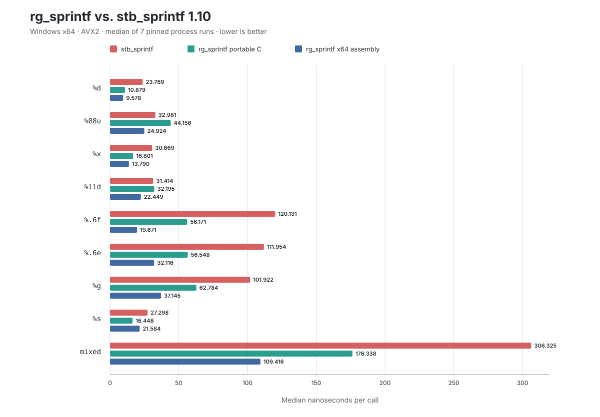
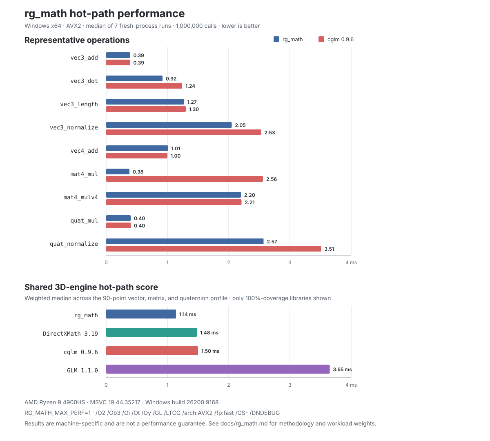

# rg-core

Small, portable C libraries for game and realtime applications.

## Available libraries

- `rg_math.h` — SIMD-accelerated scalar, vector, matrix, quaternion, camera,
  curve, geometry, and noise helpers with portable scalar fallbacks.
- `rg_string.h` — in-place string utilities, bounded replacement and joining,
  UTF-8 helpers, and arena-backed length-aware strings.
- `rg_algo.h` — macro-generated typed sorting, selection, searching, min/max,
  and stable 32/64-bit radix sorting.
- `rg_hash.h` — deterministic 64-bit hashing and arena-backed, typed
  robin-hood hash maps and sets.
- `rg_random.h` — deterministic xoshiro256** generation with unbiased ranges,
  shuffling, byte filling, and common probability distributions.
- `rg_mem.h` — global OS-backed memory pool with typed bump-arena allocation,
  reset, alignment, and optional secure clearing.
- `rg_log.h` — lightweight severity-based logging with source locations,
  optional color and timestamps, and `rg_sprintf` formatting.
- `rg_assert.h` — configurable assertion, ensure, and panic helpers with
  optional `rg_log` integration.
- `rg_sprintf_hybrid.h` — selects the assembly-accelerated formatter when its
  platform helper is linked and otherwise uses the portable implementation.
- `rg_sprintf.h` — the portable formatter, covering the common `printf` subset
  used by games plus direct numeric conversion, hexadecimal conversion,
  callback output, and a bounded string builder.

## Inspiration

`rg_sprintf` was inspired by Sean Barrett's excellent
[`stb_sprintf`](https://github.com/nothings/stb). I set out to build a formatter
that could go faster on common game and realtime workloads, with a portable C
fallback and optional x64 assembly acceleration.

## Performance

### rg_sprintf



These measurements compare `stb_sprintf` 1.10 with the portable C and x64
assembly implementations of `rg_sprintf`. See the
[benchmark methodology](docs/rg_sprintf.md#performance) for the test cases,
build configuration, and hardware details. Results are machine-specific.

### rg_math



The math figure compares representative operations with cglm and summarizes a
shared 3D-engine hot-path profile across fully covered libraries. See the
[benchmark methodology](docs/rg_math.md#performance) for workload weights,
build configuration, hardware details, and the complete plotted values.
Results are machine-specific.

## Build and test

From a Visual Studio Developer Command Prompt:

```bat
build.bat test
```

The test target builds portable AVX2, scalar, hybrid assembly, hybrid C
fallback, and secure formatter configurations, then runs the logging,
assertion, memory, string, hash, random, algorithm, and math suites. Math is
checked with baseline SIMD, AVX2, checked SIMD and scalar, plain-layout,
reduced-module, and C++17 builds. On Windows x64, the formatter tests assemble
and link the included MASM helper automatically.

## Usage

```c
#include "src/rg_sprintf_hybrid.h"

char buffer[128];
rg_snprintf(buffer, sizeof(buffer), "entity=%u position=(%.2f, %.2f)",
            entity_id, x, y);
```

All functions are `static`. The headers can be included directly in unity
builds without an implementation toggle.

## License and trademark

The software and documentation are available under the [MIT License](LICENSE).
Reverse Gravity is a registered trademark of Steven Wendel in the United
States. The license grants rights to the software and documentation, but not
to the Reverse Gravity name or trademark except to identify the origin of this
software. See the
[USPTO trademark record](https://tmsearch.uspto.gov/search/search-results/86371513)
(Serial No. `86371513`, Registration No. `4805325`).
