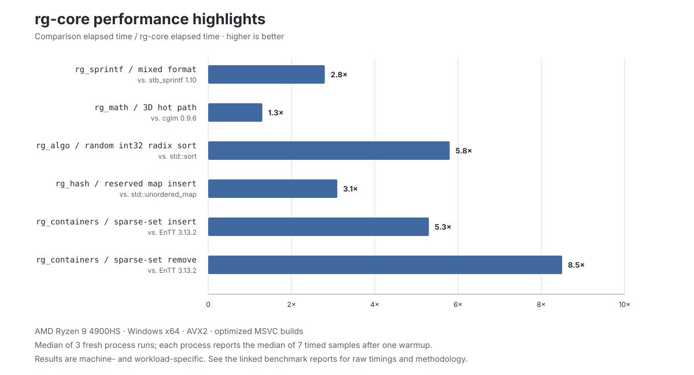

# Reverse Gravity Core Libraries

**Unapologetically fast C for real-time systems.**

`rg-core` is a collection of small, portable, single-header C libraries for
game and real-time applications. These are the foundational libraries I use to
make games at Reverse Gravity, designed to be included directly in unity
builds.

## Single-header, unity-build first

Add the headers a game needs directly to its unity translation unit. Their
functions have internal linkage, so there is no implementation toggle to define
or separate C library target to build. The optional `rg_sprintf` assembly
acceleration is linked alongside that unity translation unit. Stateful modules
such as memory, logging, and timing then naturally share one state across the
game.

Most headers can also be used from conventionally compiled C or C++ translation
units. The documentation for each module calls out behavior that matters in
that configuration.

## Available libraries

- [`rg_sdl.h`](docs/rg_sdl.md), [`rg_window.h`](docs/rg_window.md),
  [`rg_input.h`](docs/rg_input.md), and [`rg_gpu.h`](docs/rg_gpu.md) — the SDL3
  foundation used by the Reverse Gravity graphics stack: application lifetime,
  windows, input state and ordered events, GPU uploads, and compiled shader
  loading.
- [`rg_bin.h`](docs/rg_bin.md) — endian-aware integer and floating-point loads
  and stores, pointer and bounded cursors, and ULEB128/zigzag variable-length
  integers.
- [`rg_math.h`](docs/rg_math.md) — SIMD-accelerated scalar, vector, matrix,
  quaternion, camera, curve, geometry, and noise helpers with portable scalar
  fallbacks.
- [`rg_string.h`](docs/rg_string.md) — in-place string utilities, bounded
  replacement and joining, UTF-8 helpers, and arena-backed length-aware strings.
- [`rg_containers.h`](docs/rg_containers.md) — arena-backed typed dynamic arrays,
  inline small vectors, power-of-two ring buffers, and sparse sets.
- [`rg_algo.h`](docs/rg_algo.md) — macro-generated typed sorting, selection,
  searching, min/max, and stable 32/64-bit radix sorting.
- [`rg_hash.h`](docs/rg_hash.md) — deterministic 64-bit hashing and arena-backed,
  typed robin-hood hash maps and sets.
- [`rg_random.h`](docs/rg_random.md) — deterministic xoshiro256** generation with
  unbiased ranges, shuffling, byte filling, and common probability
  distributions.
- [`rg_time.h`](docs/rg_time.md) — high-resolution monotonic timing, tick
  conversion, sleeping, and yielding with native and custom platform backends.
- [`rg_mem.h`](docs/rg_mem.md) — global OS-backed memory pool with typed
  bump-arena allocation, reset, alignment, and optional secure clearing.
- [`rg_log.h`](docs/rg_log.md) — lightweight severity-based logging with source
  locations, optional color and timestamps, and `rg_sprintf` formatting.
- [`rg_assert.h`](docs/rg_assert.md) — configurable assertion, ensure, and panic
  helpers with optional `rg_log` integration.
- [`rg_sprintf_hybrid.h`](docs/rg_sprintf.md) — selects the assembly-accelerated
  formatter when its platform helper is linked and otherwise uses the portable
  implementation.
- [`rg_sprintf.h`](docs/rg_sprintf.md) — the portable formatter, covering the
  common `printf` subset used by games plus direct numeric conversion,
  hexadecimal conversion, callback output, and a bounded string builder.

## Usage

A small game can make the core headers and its own implementation files part of
one translation unit. For example, `game_unity.c` can own application lifetime,
input, and frame timing:

```c
#include "src/rg_sdl.h"
#include "src/rg_window.h"
#include "src/rg_input.h"
#include "src/rg_time.h"

// Larger games can include their implementation files here too:
// #include "game.c"
// #include "render.c"

int main(void)
{
	if (!rg_sdl_init(SDL_INIT_VIDEO)) return 1;

	RgWindowDesc window_desc = {0};
	window_desc.title = "Reverse Gravity Game";
	window_desc.width = 1280;
	window_desc.height = 720;
	window_desc.flags = SDL_WINDOW_RESIZABLE;

	SDL_Window* window = rg_window_create(&window_desc);
	if (!window)
	{
		rg_sdl_quit();
		return 1;
	}

	RgInputState input = {0};
	rg_input_init(&input);
	rg_time_init();

	u64 previous_ticks = rg_time_ticks();
	int running = 1;
	while (running)
	{
		rg_input_update(&input);

		SDL_Event event;
		while (SDL_PollEvent(&event))
		{
			rg_input_process_event(&input, &event);
			if (event.type == SDL_EVENT_QUIT) running = 0;
		}

		if (rg_input_is_key_pressed(&input, SDL_SCANCODE_ESCAPE))
		{
			running = 0;
		}

		u64 current_ticks = rg_time_ticks();
		f64 delta_seconds =
			rg_time_ticks_to_seconds(current_ticks - previous_ticks);
		previous_ticks = current_ticks;

		// game_update(delta_seconds);
		// game_render();
		(void)delta_seconds;
	}

	rg_window_destroy(window);
	rg_sdl_quit();
	return 0;
}
```

SDL3 is an external dependency for the application, window, input, and GPU
headers. Each library's linked documentation has focused examples and its
configuration options.

## Inspiration

`rg_sprintf` was inspired by Sean Barrett's excellent
[`stb_sprintf`](https://github.com/nothings/stb). I set out to build a formatter
that could go faster on common game and real-time workloads, with a portable C
fallback and optional x64 assembly acceleration.

## Performance



Speedup is comparison elapsed time divided by `rg-core` elapsed time. The
benchmarks run implementations in the same optimized executable; results are
machine- and workload-specific.

### rg_sprintf


These measurements compare `stb_sprintf` 1.10 with the portable C and x64
assembly implementations of `rg_sprintf`. See the
[benchmark methodology](docs/rg_sprintf.md#performance) for the test cases,
build configuration, and hardware details. Results are machine-specific.

### rg_math


The math figure compares representative operations with cglm and summarizes a
shared 3D-engine hot-path profile across fully covered libraries. See the
[benchmark methodology](docs/rg_math.md#performance) for workload weights,
build configuration, hardware details, and the complete plotted values.
Results are machine-specific.

### rg_algo, rg_hash, and rg_containers

The core benchmark suite measures sorting and selection, integer-key hash-map
operations, dynamic arrays, ring buffers, small vectors, and sparse sets. The
[complete results and methodology](docs/benchmarks/rg-core.md) include raw
medians, comparison versions, allocation boundaries, and limitations. The
[benchmark sources](benchmarks) run against the public headers in this
repository.

## Build, test, and benchmark

From a Visual Studio Developer Command Prompt:

```bat
build.bat test
```

The test target builds portable AVX2, scalar, hybrid assembly, hybrid C
fallback, and secure formatter configurations, then runs the logging,
assertion, memory, container, timing, binary I/O, string, hash, random,
algorithm, and math suites.
String is checked with baseline scalar, AVX2, forced-scalar, secure, and C++17
builds.
Math is checked with baseline SIMD, AVX2, checked SIMD and scalar,
plain-layout, reduced-module, and C++17 builds. On Windows x64, the formatter
tests assemble and link the included MASM helper automatically. When SDL3 is
available, the aggregate target also runs the SDL foundation and input suites;
set `SDL3_DIR` to an SDL3 development package root to select it explicitly.

Reproduce the documented three-process benchmark medians with:

```bat
build.bat bench_median
```

Use `build.bat bench` for a quicker one-process diagnostic pass.

Set `RG_BENCH_DEPS` to enable the optional quadsort, crumsort, `stb_ds`, and
EnTT comparisons described in the
[benchmark report](docs/benchmarks/rg-core.md#reproducing-the-benchmarks).

## License and trademark

The software and documentation are available under the [MIT License](LICENSE).
Reverse Gravity is a registered trademark of Steven Wendel in the United
States. The license grants rights to the software and documentation, but not
to the Reverse Gravity name or trademark except to identify the origin of this
software. See the
[USPTO trademark record](https://tmsearch.uspto.gov/search/search-results/86371513)
(Serial No. `86371513`, Registration No. `4805325`).
